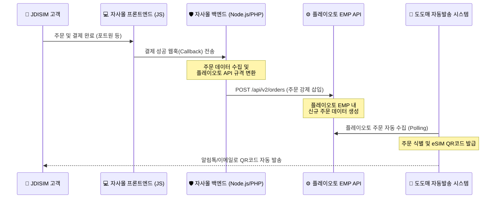

# ⚙️ JDISIM ➡️ 플레이오토 EMP API 주문 수집 연동 가이드

본 문서는 JDISIM 자사몰에서 고객 결제 시, 주문 정보를 플레이오토 EMP 솔루션으로 안전하고 즉각적으로 전송하여 **도도매 발송 대행 업체가 자동으로 수집 및 eSIM 발송을 대행할 수 있도록** 설계된 연동 규격 가이드라인입니다.

---

## 1. 🔄 연동 전체 아키텍처



---

## 2. 📝 플레이오토 EMP 주문 수집 전송 규격 (JSON Payload)

결제 완료 콜백 수신 시, 자사몰 백엔드에서 플레이오토 API 엔드포인트(`https://api.plto.com/v2/orders`)로 전송해야 할 표준 데이터 규격입니다.

### Request Headers
```http
Content-Type: application/json
Authorization: Bearer [YOUR_PLAYAUTO_API_KEY]
```

### Request Body (JSON)
```json
{
  "api_key": "YOUR_PLAYAUTO_API_KEY",
  "signature": "hmac_sha256_hash_value",
  "action": "order_insert",
  "order_info": {
    "order_num": "JD20260707-123456",
    "mall_id": "jdisim",
    "mall_name": "JDISIM 자사몰",
    "order_date": "2026-07-06T15:00:00.000Z",
    "payment_price": 5400,
    "buyer": {
      "name": "홍길동",
      "phone": "01012345678",
      "email": "customer@example.com"
    },
    "receiver": {
      "name": "홍길동",
      "phone": "01012345678",
      "zipcode": "00000",
      "address1": "이메일/알림톡 실시간 전송 (무배송 상품)",
      "address2": ""
    },
    "items": [
      {
        "product_code": "LS2026-eSIM-03176",
        "product_name": "일본 Softbank 매일 1GB / 5일",
        "quantity": 1,
        "price": 5400,
        "iccid_issued": "8982300000000000001"
      }
    ]
  }
}
```

---

## 3. ⚠️ 연동 시 주요 주의사항 및 필수 선결 조건

1. **도도매처 상품코드(Product Code) 1:1 매칭**
   - 가장 중요합니다! 자사몰에서 넘겨주는 `"product_code"`(예: `LS2026-eSIM-03176`)가 플레이오토 EMP에 동일하게 등록되어 있어야 합니다. 
   - 코드가 일치해야 도도매 발송 대행 업체 측 시스템이 주문을 수집할 때 **"어떤 국가의 몇 일짜리 요금제 상품인지"** 판별하여 정확한 eSIM을 발송할 수 있습니다.
2. **API 연동 부가서비스 구독**
   - 플레이오토 관리자 홈 ➡️ `결제` ➡️ `이용료 결제` ➡️ `구독형 부가서비스`에서 **API 연동 기능**이 구매 및 활성화되어 있어야 인증 키가 작동합니다.
3. **Secret Key를 활용한 보안 Signature 검증**
   - 결제 변조 및 해킹 방지를 위해 자사몰 백엔드에서 서명 값(`signature`)을 함께 생성하여 전송하는 것을 권장합니다.

---

## 4. 제공된 통합 연동 소스파일 안내

- **[playauto_webhook.js](file:///c:/Users/tjdrn/Desktop/이심 사이트/playauto_webhook.js)**: 
  - Node.js Express 및 Axios 기반의 실제 백엔드 연동 뼈대 소스파일입니다. 포트원 결제 완료 웹훅을 받아 플레이오토 API로 주문을 즉시 밀어 넣어주는 핸들러가 구현되어 있습니다.
- **[app.js](file:///c:/Users/tjdrn/Desktop/이심 사이트/app.js)**:
  - 프론트엔드 모의 결제 완료 즉시, 위 플레이오토 규격에 맞춘 JSON 데이터가 개발자 도구 콘솔(`F12`)에 로깅되도록 시뮬레이션 패널을 이식해 두었습니다.
